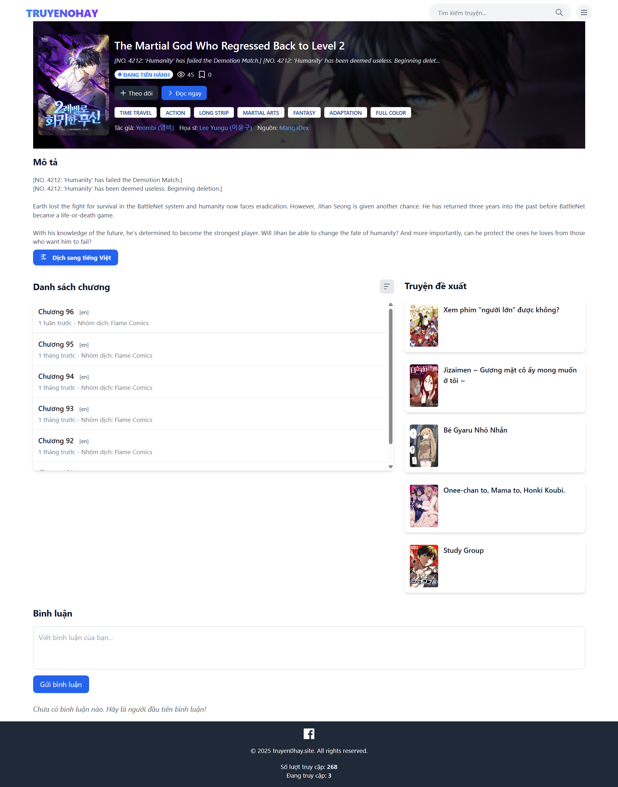
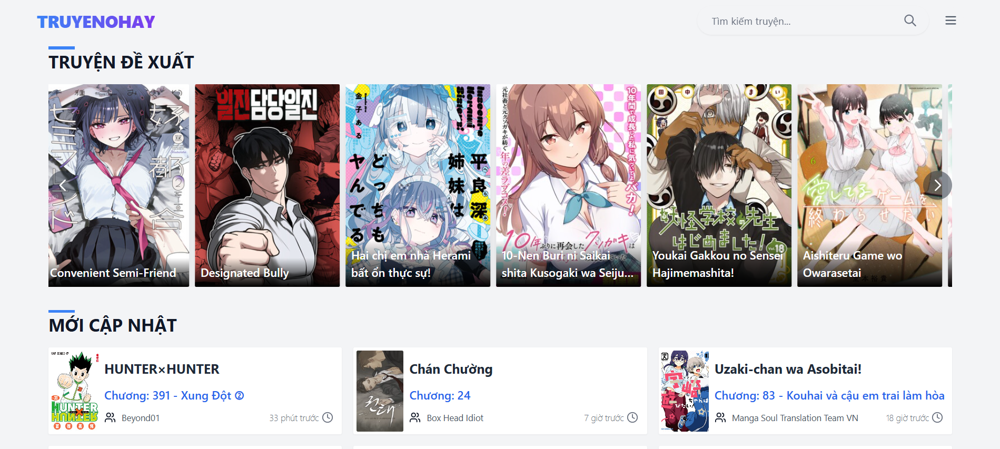
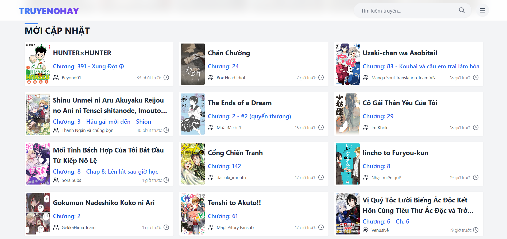
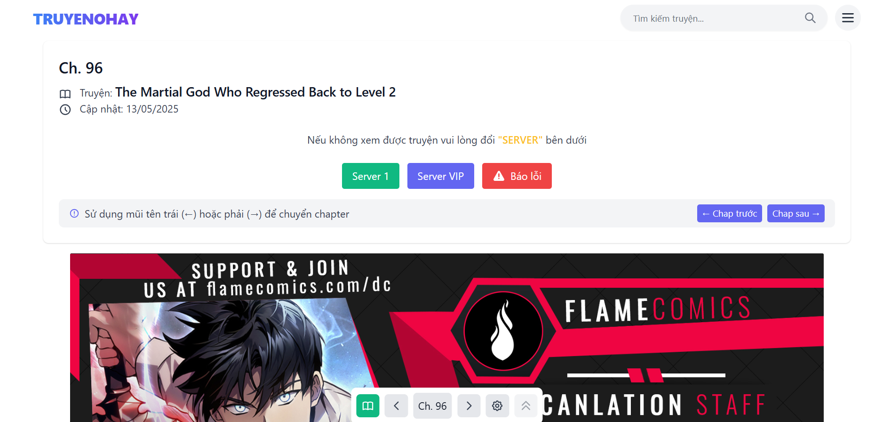
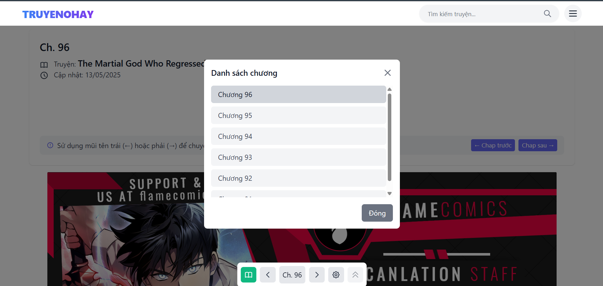
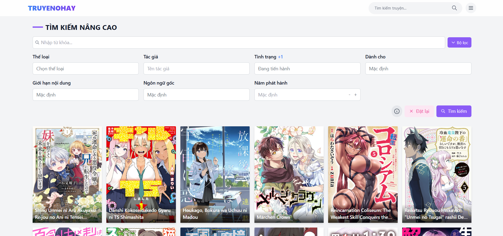
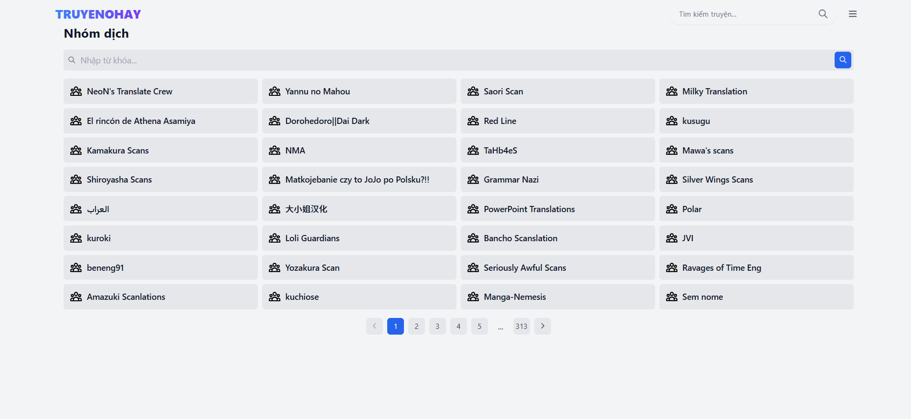

# 📚 Truyen0Hay - Website Đọc Truyện Tranh Online

## ℹ️ Giới thiệu

Truyen0Hay là website đọc truyện tranh trực tuyến dành cho những người yêu thích manga. Sử dụng API từ Mangadex, dự án được xây dựng hoàn toàn bằng PHP thuần và phát triển trên môi trường Laragon, đảm bảo trải nghiệm nhẹ nhàng nhưng mạnh mẽ. Các tính năng chính bao gồm:

- **Thư viện manga phong phú**: Truy cập kho truyện tranh đa dạng với hàng ngàn tựa manga và chương mới qua tích hợp Mangadex.
- **Giao diện thân thiện**: Thiết kế responsive, dễ sử dụng với tính năng tìm kiếm nâng cao, gợi ý cá nhân hóa và theo dõi lịch sử đọc.
- **Đăng nhập an toàn**: Hỗ trợ Google OAuth để đăng nhập nhanh chóng và bảo mật.
- **Chống spam**: Tích hợp Cloudflare Turnstile để bảo vệ form khỏi spam.
- **Quản lý hình ảnh**: Sử dụng Imgur API để tải lên và quản lý hình ảnh truyện hiệu quả.

Truyen0Hay mang đến trải nghiệm đọc truyện tuyệt vời cho người hâm mộ manga, đồng thời cung cấp mã nguồn mở để các lập trình viên tùy chỉnh và phát triển thêm. Dù bạn là độc giả hay nhà phát triển, Truyen0Hay là cánh cửa dẫn bạn đến thế giới manga đầy màu sắc!

---

## 📸 Ảnh chụp màn hình

Dưới đây là các ảnh chụp thể hiện các tính năng chính và giao diện của Truyen0Hay:

| **Trang Chủ** | **Thông Tin Truyện** | **Truyện Đề Xuất** |
|:-------------:|:--------------------:|:------------------:|
|  |  |  |

| **Truyện Mới Cập Nhật** | **Đề Xuất Tìm Kiếm** | **Sidebar** |
|:-----------------------:|:--------------------:|:-----------:|
|  |  |  |

| **Trang Đọc Truyện** | **Form Chapter** | **Tìm Kiếm Nâng Cao** |
|:--------------------:|:----------------:|:---------------------:|
|  |  |  |

| **Nhóm Dịch** | **Tổng Thể** |
|:-------------:|:------------:|
|  |  |

---

## 🔧 Cấu hình & Hướng dẫn thay đổi

### 1. 📧 Cấu hình gửi Email - `config/send_email.php`

```php
// Dòng 71-72
$mail->Username = 'truyentranhnetcontact@gmail.com'; // Email gửi
$mail->Password = 'bbbb aaaa xxxx tttt'; // 🔐 Mật khẩu ứng dụng Gmail

// Dòng 79-80
$resetLink = "http://truyenkhonghay.test/src/auth/reset_password.php?token=" . $token;
// => Khi deploy online, dùng:
$resetLink = "https://truyen0hay.site/src/auth/reset_password.php?token=" . $token;
```

### 2. 🔐 Google OAuth2 Login - `src/auth/login.php`

```php
// Dòng 14-16
$googleClientID = '###';  // Thay Client ID của Google Auth Platform
$googleClientSecret = '###'; // Thay Client Secret của Google Auth Platform
$googleRedirectUri = 'http://localhost/truyenkhonghay/src/auth/login.php'; // Thay localhost bằng domain của bạn
```

🔗 Tạo OAuth Client ID tại: [Google Cloud Console](https://console.cloud.google.com/apis/credentials)

### 3. 🧱 Cloudflare Turnstile - Chống spam form

```php
// login.php dòng 24
$turnstileSecret = '###';

// register.php dòng 6
$turnstileSecret = '###';
```

🔗 Tạo Turnstile key tại: [Cloudflare Dashboard](https://dash.cloudflare.com/) > Turnstile

### 4. 💾 Cấu hình cơ sở dữ liệu - `config/database.php`

```php
// Dòng 2-5
$servername = "localhost";
$username = "root";
$password = "";
$dbname = "truyen0hay";
```

📌 Điều chỉnh theo thông tin máy chủ SQL của bạn. Khi chạy trên local, truy cập đường dẫn `http://truyenkhonghay.test/` để đảm bảo hoạt động chính xác.

### 5. 📸 Cấu hình Imgur API - `admin/upload-manga.php`

```php
// Dòng 48, 123, 256
$imgurClientId = '3cea3f0e5d5c043'; // Client ID của bạn
```

🔗 Tạo ứng dụng tại: [Imgur API](https://api.imgur.com/oauth2/addclient)

## ✅ Yêu cầu hệ thống

- PHP >= 7.4
- MySQL/MariaDB
- Laragon (hoặc XAMPP/WAMP)
- Composer (cho các phần mở rộng)

## 📁 Cấu trúc thư mục chính

```
truyen0hay/
├── admin/
│   ├── setting.php
│   └── upload-manga.php
├── config/
│   ├── config.php
│   ├── database.php
│   └── send_email.php
├── css/
│   ├── manga.css
│   └── style.css
├── google-api/
├── includes/
│   ├── advanced-search-form.php
│   ├── content-customizer.php
│   ├── count_views.txt
│   ├── footer.php
│   ├── get-group.php
│   ├── latest-card.php
│   ├── manga-up.php
│   ├── navbar.php
│   ├── pagination.php
│   ├── search-groups.php
│   ├── sidebar.php
│   ├── staff-pick-card.php
│   ├── swiper-components.php
│   ├── theme-customizer.php
│   └── track_visits.php
├── js/
│   ├── advanced-search.js
│   ├── main.js
│   ├── reader.js
│   └── search.js
├── lib/
│   ├── functions.php
│   └── PHPMailer/
│       └── (các file của PHPMailer)
├── public/
│   ├── flags/
│   ├── icon/
│   └── images/
├── src/
│   ├── auth/
│   │   ├── forget_password.php
│   │   ├── login.php
│   │   ├── logout.php
│   │   ├── register.php
│   │   └── reset_password.php
│   └── session.php
├── .htaccess
├── advanced-search.php
├── chapter.php
├── doc.php
├── follow.php
├── groups.php
├── history.php
├── index.php
├── latest.php
├── manga.php
├── proxy-0hay.php
├── readme.md
├── recent.php
├── search-suggestions.php
├── search.php
└── truyen.php
```

## 🤝 Góp ý & Liên hệ

Mọi góp ý hoặc báo lỗi, vui lòng liên hệ:  
📩 [truyentranhnetcontact@gmail.com](mailto:truyentranhnetcontact@gmail.com)
